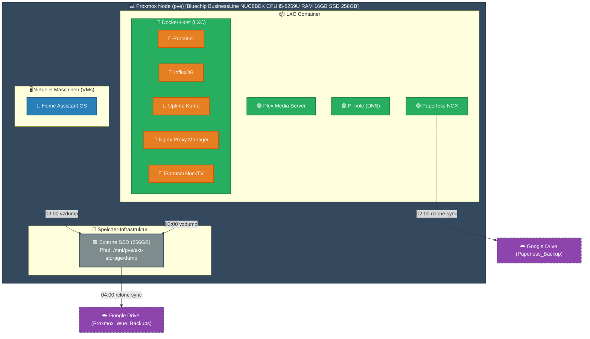
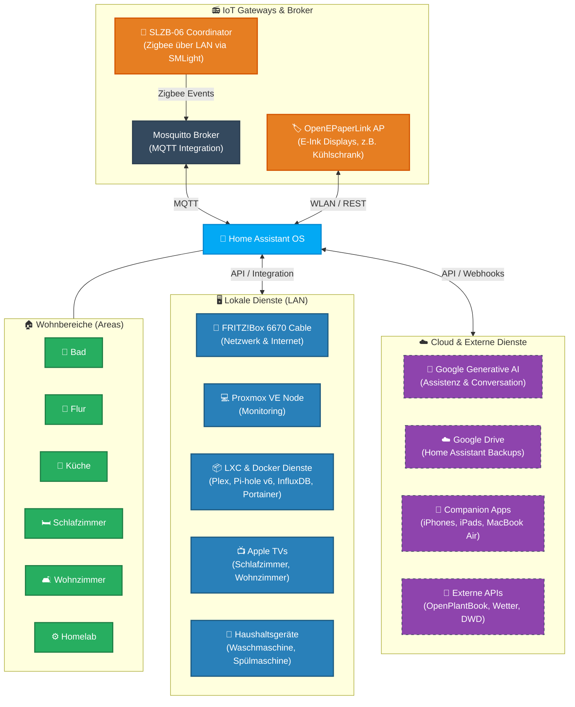
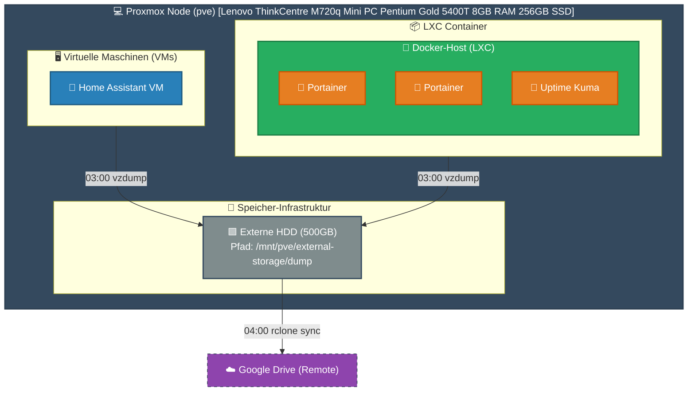
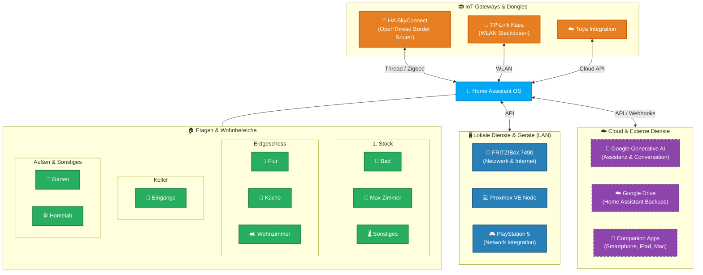
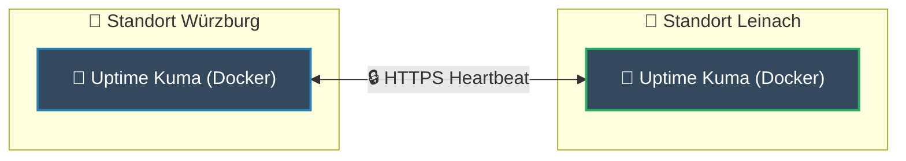

# ⚙️ Homelab (Standort Würzburg)

## 🏗️ 1. System- & Container-Architektur

## 🕓 2. Cronjobs

1. 02:00 Uhr: Paperless Document Export & Cloud-Sync (Paperless-LXC) $\rightarrow$ Erstellt einen konsistenten Dokumenten-/Datenbankexport und synchronisiert ihn via Rclone zu Google Drive
2. 03:00 Uhr: Proxmox VZDump Backup (pve-Node) $\rightarrow$ Sichert alle VMs und LXC-Container als Backup-Dump auf die externe SSD
3. 04:00 Uhr: Proxmox Rclone Backup (pve-Node) $\rightarrow$ Synchronisiert lokale Dumps zu Google Drive.
4. 04:00 Uhr (Sonntags): yt-dlp Auto-Update (Plex-LXC) $\rightarrow$ Aktualisiert den yt-dlp auf die neueste Version.
5. 05:15 Uhr: Plex Leere Ordner löschen (Plex-LXC, yt-worker) $\rightarrow$ Entfernt verwaiste Verzeichnisse.
6. 05:30 Uhr: Plex Smart Cleanup (Plex-LXC, yt-worker) $\rightarrow$ Löscht gesehene YouTube-Videos nach einer Frist von 5 Tagen.

```mermaid
sequenceDiagram
    autonumber
    participant HA as 🔹 Home Assistant (VM)
    participant PVE as 💻 Proxmox Host (pve)
    participant PaperlessLXC as 🟢 Paperless LXC
    participant PlexLXC as 🟢 Plex LXC
    participant Influx as 🔸 InfluxDB (Docker)
    participant SSD as 🟪 Externe SSD
    participant GDrive as ☁️ Google Drive

    %% --- ABLAUF 1: PAPERLESS EXPORT & SYNC (02:00 UHR) ---
    rect rgb(39, 174, 96)
        Note over PaperlessLXC, GDrive: ABLAUF 1: Paperless Backup & Cloud Sync (02:00 Uhr)
        Note over PaperlessLXC: Crontab startet cron-monitor.sh
        activate PaperlessLXC
        PaperlessLXC->>PaperlessLXC: 1a. document_exporter schreibt Export nach /opt/paperless/export
        PaperlessLXC->>GDrive: 1b. rclone sync nach gdrive:Paperless_Backup
        PaperlessLXC->>Influx: 1c. cron-monitor.sh meldet duration & exit_code
        deactivate PaperlessLXC
    end

    %% --- ABLAUF 2: PROXMOX VZDUMP BACKUP (03:00 UHR) ---
    rect rgb(52, 73, 94)
        Note over PVE, SSD: ABLAUF 2: Proxmox Node Backup (03:00 Uhr)
        Note over PVE: Integrierter PVE-Backup-Job (vzdump)
        activate PVE
        PVE->>SSD: 2a. Sichert alle VMs & LXCs als Dump-Dateien (/mnt/pve/ext-storage/dump)
        deactivate PVE
    end

    %% --- ABLAUF 3: PROXMOX RCLONE CLOUD SYNC (04:00 UHR) ---
    rect rgb(46, 204, 113)
        Note over PVE, GDrive: ABLAUF 3: Proxmox Rclone Backup (04:00 Uhr)
        Note over PVE: Lokale System-Crontab löst Backup aus
        activate PVE
        PVE->>GDrive: 3a. rclone sync von externer SSD nach GDrive
        GDrive-->>PVE: 3b. Sync erfolgreich beendet
        PVE->>Influx: 3c. cron-monitor.sh sendet duration & exit_code
        deactivate PVE
    end

    %% --- ABLAUF 4: YT-DLP UPDATE (04:00 UHR, SONNTAGS) ---
    rect rgb(230, 126, 34)
        Note over PlexLXC: ABLAUF 4: yt-dlp Auto-Update (04:00 Uhr, Sonntags)
        Note over PlexLXC: Lokale Crontab (root/yt-worker)
        activate PlexLXC
        PlexLXC->>PlexLXC: 4a. yt-dlp -U
        deactivate PlexLXC
    end

    %% --- ABLAUF 5: PLEX LEERE ORDNER LÖSCHEN (05:15 UHR) ---
    rect rgb(44, 62, 80)
        Note over PlexLXC, Influx: ABLAUF 5: Plex Leere Ordner löschen (05:15 Uhr)
        Note over PlexLXC: Lokale Crontab (Benutzer: yt-worker)
        activate PlexLXC
        PlexLXC->>PlexLXC: 5a. find-Skript räumt leere Verzeichnisse auf
        PlexLXC->>Influx: 5b. cron-monitor.sh meldet Werte an InfluxDB
        deactivate PlexLXC
    end

    %% --- ABLAUF 6: PLEX SMART CLEANUP (05:30 UHR) ---
    rect rgb(142, 68, 173)
        Note over PlexLXC, HA: ABLAUF 6: Plex Smart Cleanup (05:30 Uhr)
        Note over PlexLXC: Lokale Crontab (Benutzer: yt-worker)
        activate PlexLXC
        PlexLXC->>PlexLXC: 6a. plex_cleaner.py löscht geschaute Videos (>5 Tage)
        PlexLXC->>Influx: 6b. cron-monitor.sh meldet Werte an InfluxDB
        PlexLXC->>HA: 6c. Python sendet Webhook an HA (Titel-Liste für iPhone)
        deactivate PlexLXC
    end

    %% --- ABFRAGE-SCHLEIFE (DEAD-MAN-SWITCH) ---
    rect rgb(41, 128, 185)
        Note over HA, Influx: KONTINUIERLICHE ÜBERWACHUNG (Dead-Man-Switch)
        loop Alle paar Minuten
            HA->>Influx: 7a. Flux Query (Prüfe letzten Eintrag im Fenster -26h)
            Influx-->>HA: 7b. Liefert Daten für ALLE Jobs (Dauer & Status)
        end
    end
```

⚠️ Wichtiger Hinweis zum Linux-Pipe-Buffer: Bei Aufrufen über die Home Assistant SSH-Schnittstelle müssen textintensive Skripte zwingend mittels > /dev/null 2>&1 umgeleitet werden. Andernfalls läuft der 64 KB große OS-Pipe-Buffer voll, was zu einem Deadlock (Einfrieren) des Skripts führt.

## 🏠 3. Home Assistant

# Homelab (Standort Leinach)
## 🏗️ 1. System- & Container-Architektur

## 🕓 2. Cronjobs

1. 03:00 Uhr: Proxmox VZDump Backup (pve-Node) $\rightarrow$ Sichert alle VMs und LXC-Container als Backup-Dump auf die externe SSD
2. 04:00 Uhr: Proxmox Rclone Backup (pve-Node) $\rightarrow$ Synchronisiert lokale Dumps zu Google Drive.

```mermaid
sequenceDiagram
    autonumber
    participant PVE as 💻 Proxmox Host (pve)
    participant HDD as 🟪 Externe HDD
    participant GDrive as ☁️ Google Drive
    participant Influx as 🔸 InfluxDB (Docker)

    %% --- ABLAUF 1: PROXMOX VZDUMP BACKUP (03:00 UHR) ---
    rect rgb(52, 73, 94)
        Note over PVE, HDD: ABLAUF 1: Proxmox Node Backup (03:00 Uhr)
        Note over PVE: Integrierter PVE-Backup-Job (vzdump)
        activate PVE
        PVE->>HDD: 1a. Sichert Home Assistant VM & Docker LXC als Dump-Dateien
        deactivate PVE
    end

    %% --- ABLAUF 2: PROXMOX RCLONE CLOUD SYNC (04:00 UHR) ---
    rect rgb(46, 204, 113)
        Note over PVE, GDrive: ABLAUF 2: Proxmox Rclone Backup (04:00 Uhr)
        Note over PVE: Lokale System-Crontab löst Backup aus
        activate PVE
        PVE->>GDrive: 2a. rclone sync von externer HDD nach Google Drive
        GDrive-->>PVE: 2b. Sync erfolgreich beendet
        PVE->>Influx: 2c. cron-monitor.sh sendet duration & exit_code via curl
        deactivate PVE
    end
```

## 🏠 3. Home Assistant

# 📡 Cross-Site Monitoring

