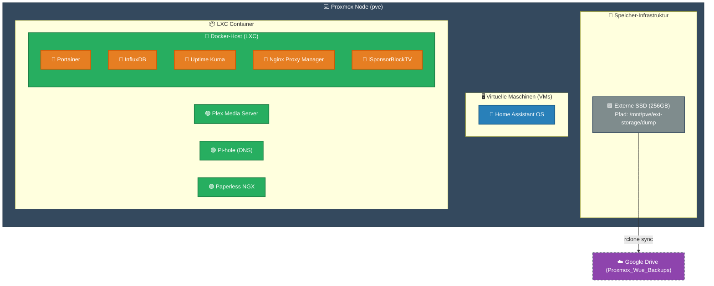
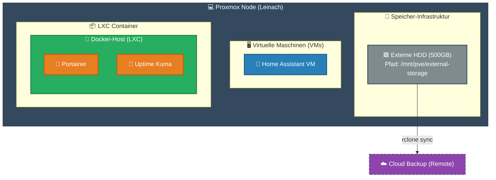
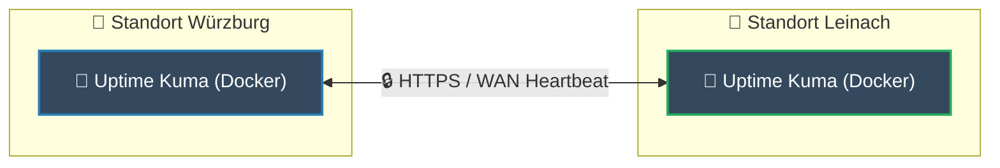

# ⚙️ Homelab (Standort Würzburg)

## 🏗️ 1. System- & Container-Architektur

## 🕓 2. Cronjobs

1. 04:00 Uhr: Proxmox Rclone Backup (pve-Node) $\rightarrow$ Synchronisiert lokale Dumps zu Google Drive.
2. 05:15 Uhr: Plex Leere Ordner löschen (Plex-LXC) $\rightarrow$ Entfernt verwaiste Verzeichnisse.
3. 05:30 Uhr: Plex Smart Cleanup (Plex-LXC) $\rightarrow$ Löscht gesehene YouTube-Videos nach einer Frist von 5 Tagen.

```mermaid
sequenceDiagram
    autonumber
    participant HA as 🔹 Home Assistant (VM)
    participant PVE as 💻 Proxmox Host (pve)
    participant PlexLXC as 🟢 Plex LXC
    participant Influx as 🔸 InfluxDB (Docker)
    participant GDrive as ☁️ Google Drive

    %% --- ABLAUF 1: PROXMOX BACKUP (04:00 UHR) ---
    rect rgb(39, 174, 96)
        Note over PVE, GDrive: ABLAUF 1: Proxmox Rclone Backup (04:00 Uhr)
        Note over PVE: Lokale System-Crontab<br>löst Backup aus
        PVE->>GDrive: 1a. rclone sync von externer SSD (--delete-before)
        activate PVE
        GDrive-->>PVE: 1b. Sync erfolgreich beendet
        PVE->>Influx: 1c. cron-monitor.sh sendet duration & exit_code via curl
        deactivate PVE
    end

    %% --- ABLAUF 2: PLEX LEERE ORDNER LÖSCHEN (05:15 UHR) ---
    rect rgb(44, 62, 80)
        Note over HA, PlexLXC: ABLAUF 2: Plex Leere Ordner löschen (05:15 Uhr)
        HA->>PlexLXC: 2a. Trigger via SSH (HA Shell Command)
        activate PlexLXC
        Note over PlexLXC: Skript räumt leere Verzeichnisse auf
        PlexLXC->>Influx: 2b. cron-monitor.sh meldet Werte an InfluxDB
        deactivate PlexLXC
    end

    %% --- ABLAUF 3: PLEX SMART CLEANUP (05:30 UHR) ---
    rect rgb(142, 68, 173)
        Note over HA, PlexLXC: ABLAUF 3: Plex Smart Cleanup (05:30 Uhr)
        HA->>PlexLXC: 3a. Trigger via SSH: plex_cleaner.py
        activate PlexLXC
        Note over PlexLXC: Prüft 'lastViewedAt'<br>& löscht geschaute Videos (>5 Tage)
        PlexLXC->>Influx: 3b. cron-monitor.sh meldet Werte an InfluxDB
        PlexLXC->>HA: 3c. Python sendet Webhook an HA (Titel-Liste für iPhone)
        deactivate PlexLXC
    end

    %% --- ABFRAGE-SCHLEIFE (DEAD-MAN-SWITCH) ---
    rect rgb(41, 128, 185)
        Note over HA, Influx: KONTINUIERLICHE ÜBERWACHUNG (Dead-Man-Switch)
        loop Alle paar Minuten
            HA->>Influx: 4a. Flux Query (Prüfe letzten Eintrag im Fenster -26h)
            Influx-->>HA: 4b. Liefert Daten für ALLE 3 Jobs (Dauer & Status)
        end
    end
```

⚠️ Wichtiger Hinweis zum Linux-Pipe-Buffer: > Bei Aufrufen über die Home Assistant SSH-Schnittstelle müssen textintensive Skripte zwingend mittels > /dev/null 2>&1 umgeleitet werden. Andernfalls läuft der 64 KB große OS-Pipe-Buffer voll, was zu einem Deadlock (Einfrieren) des Skripts führt.

# Homelab (Standort Leinach)
## 🏗️ 1. System- & Container-Architektur

## 🕓 2. Cronjobs

1. 04:00 Uhr: Proxmox Rclone Backup (pve-Node) $\rightarrow$ Synchronisiert lokale Dumps zu Google Drive.

## 📡 3. Cross-Site Monitoring

